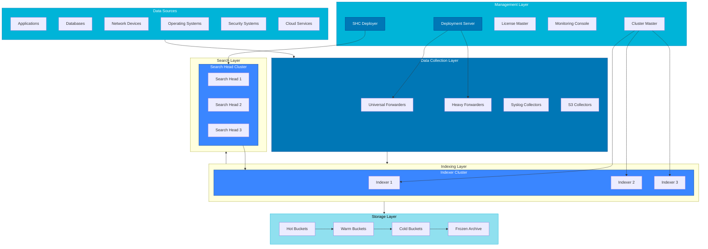

```mermaid
flowchart TB
    %% Clients/Data Sources at the top
    subgraph DataSources["Data Sources"]
        direction TB
        APP["Applications"]
        DB["Databases"]
        NET["Network Devices"]
        SYS["Operating Systems"]
        SEC["Security Systems"]
        CLOUD["Cloud Services"]
    end

    %% Data Collection Layer
    subgraph DataCollection["Data Collection Layer"]
        direction TB
        UF["Universal Forwarders"]
        HF["Heavy Forwarders"]
        SC["Syslog Collectors"]
        S3C["S3 Collectors"]
    end

    %% Management Layer
    subgraph Management["Management Layer"]
        direction TB
        DS["Deployment Server"]
        SHC_D["SHC Deployer"]
        LM["License Master"]
        MC["Monitoring Console"]
        CM["Cluster Master"]
    end

    %% Indexing Layer
    subgraph Indexing["Indexing Layer"]
        direction LR
        subgraph IDXC["Indexer Cluster"]
            direction LR
            IDX1["Indexer 1"]
            IDX2["Indexer 2"]
            IDX3["Indexer 3"]
        end
    end

    %% Storage Layer
    subgraph Storage["Storage Layer"]
        direction LR
        HOT["Hot Buckets"]
        WARM["Warm Buckets"]
        COLD["Cold Buckets"]
        FROZEN["Frozen Archive"]
    end

    %% Search Layer
    subgraph Search["Search Layer"]
        direction TB
        subgraph SHC["Search Head Cluster"]
            SH1["Search Head 1"]
            SH2["Search Head 2"]
            SH3["Search Head 3"]
        end
    end

    %% --- Enforce Vertical Flow ---
    DataSources --> DataCollection
    DataCollection --> Indexing
    Indexing --> Storage
    Indexing --> Search

    %% Specific Connections
    DS --> UF
    DS --> HF
    SHC_D --> SHC
    CM --> IDX1
    CM --> IDX2
    CM --> IDX3

    %% Single Line from Search Head Cluster to Indexer Cluster
    SHC --> IDXC

    %% Storage Flow
    HOT --> WARM
    WARM --> COLD
    COLD --> FROZEN

    %% Class Definitions for Coloring
    classDef primary fill:#3a86ff,stroke:#023e8a,color:white
    classDef secondary fill:#0077b6,stroke:#023e8a,color:white
    classDef tertiary fill:#00b4d8,stroke:#0077b6,color:white
    classDef storage fill:#90e0ef,stroke:#00b4d8,color:black
    classDef management fill:#ffba08,stroke:#ff8800,color:black

    class IDXC,SHC primary
    class DataCollection,SHC_D,DS secondary
    class DataSources,Management tertiary
    class Storage storage
```
