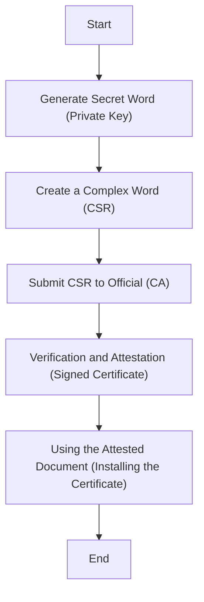

**Imagine you're a spy:**

1. **Secret Word (Private Key):** You have a secret code phrase known only to you (your private key). This phrase is highly confidential and never shared with anyone.
2. **Creating a Complex Word (CSR):** You need to send a message to your headquarters (the CA) but can't risk anyone intercepting it. You use your secret code phrase (private key) to scramble the message (encrypt it). This scrambled message becomes your Certificate Signing Request (CSR). It's complex and nonsensical to anyone without the key.
3. **Submitting CSR to Official (CA):** You send the CSR (scrambled message) to a trusted official (the CA) who can verify your identity. This official might be a high-ranking agent with access to a master codebook (trusted root certificate).
4. **Verification and Attestation (Signed Certificate):** The official (CA) uses the master codebook (trusted root certificate) to unscramble a part of your message (verifies the CSR using its own private key). They then create a new document (signed certificate) that confirms your message originated from you (authenticated) and includes a special seal (digital signature) to prove it's genuine.
5. **Using the Attested Document (Installing the Certificate):** You receive the signed certificate (with the seal) from the official (CA). This signed document (certificate) is what you present to others to prove your identity. You wouldn't share your secret code phrase (private key) with anyone, but the signed document (certificate) is safe to share as it doesn't reveal your secret.

**Key Points:**

* The secret code phrase (private key) is for your eyes only (kept secure).
* The scrambled message (CSR) is like a riddle only the official can solve (verifies the CSR). 
* The signed document (certificate) is your official ID card (proves your identity).

