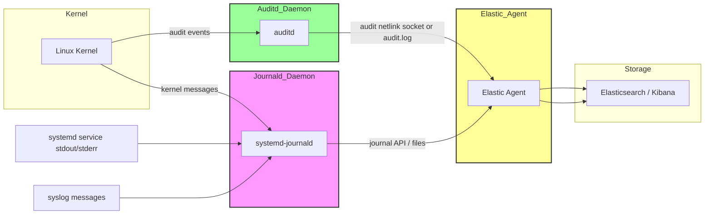
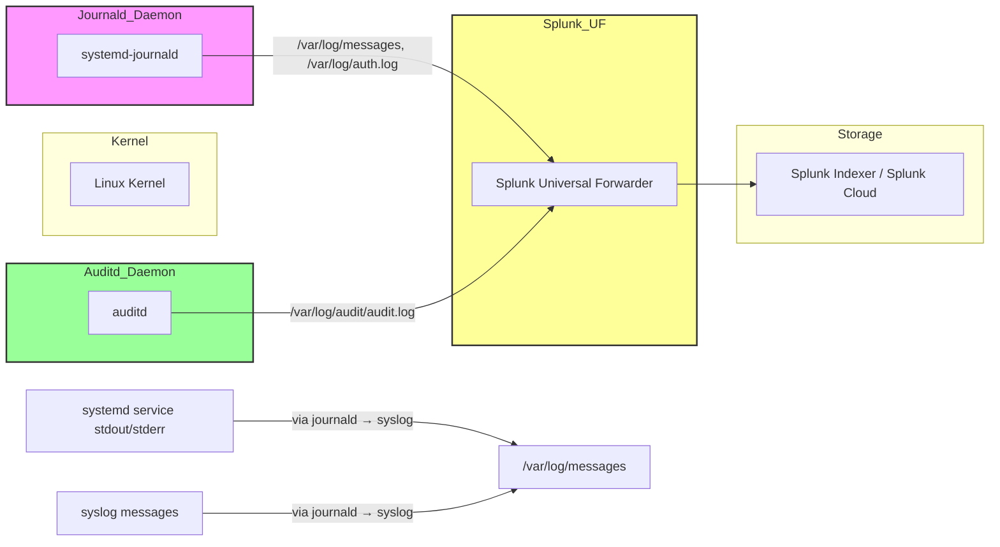

---

## **1️⃣ Systemd-journald**

* **Type:** Daemon (`systemd-journald.service`)
* **Role:** Collects logs from:

  * Kernel (`dmesg`)
  * Systemd services (stdout/stderr)
  * Syslog messages
* **Elastic Agent collection:**

  * Elastic Agent **reads from journald** via the journal API (not directly from kernel memory).
  * Journald acts as a **buffer**, storing logs on disk (`/var/log/journal`) or in memory.
* **Kernel interaction:**

  * Journald **does get messages from the kernel**, but Elastic Agent does **not pull from kernel directly** — it talks to journald.

---

## **2️⃣ auditd**

* **Type:** Daemon (`auditd.service`)
* **Role:** Collects security/audit events: syscalls, SELinux denials, login attempts, sudo usage, etc.
* **Elastic Agent collection:**

  * There are two options:

    1. **From auditd service / audit netlink socket** (preferred, real-time)
    2. **From `/var/log/audit/audit.log` file** (older, batch reading)
* **Kernel interaction:**

  * Auditd **receives events directly from the Linux kernel via the audit subsystem**.
  * Elastic Agent can listen to the audit netlink socket **or** just read auditd’s logs — it does **not pull directly from the kernel** itself.

---

### **3️⃣ Key difference**

| Daemon   | Elastic Agent talks to       | Kernel interaction                 |
| -------- | ---------------------------- | ---------------------------------- |
| journald | journald API / journal files | journald reads kernel messages     |
| auditd   | auditd service / audit.log   | auditd receives events from kernel |

✅ So in **both cases**, Elastic Agent is **not pulling directly from the kernel**, it talks to the daemon (or the daemon’s files/socket) that is responsible for collecting events from the kernel.

---

## Elastic Agent

---

## Splunk UF

