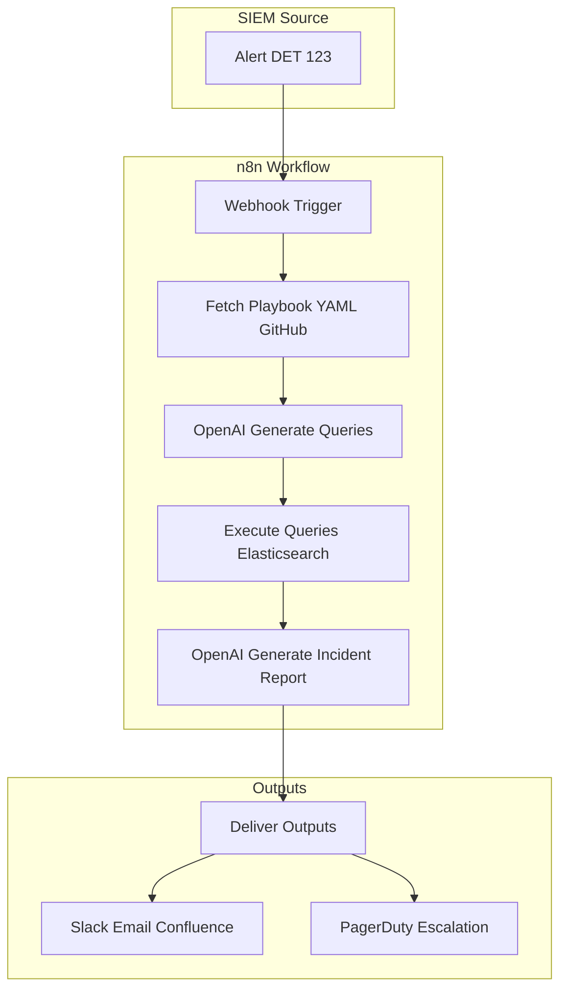

```mermaid
flowchart TB
    subgraph SIEM[SIEM Source]
        A[Alert DET 123]
    end

    subgraph N8N[n8n Workflow]
        direction LR
        B[Webhook Trigger] --> C[Fetch Playbook YAML GitHub]
        C --> D[OpenAI Generate Queries]
        D --> E[Execute Queries Elasticsearch]
        E --> F[OpenAI Generate Incident Report]
    end

    subgraph OUTPUTS[Outputs]
        direction LR
        G[Deliver Outputs] --> G1[Slack Email Confluence]
        G --> G2[PagerDuty Escalation]
    end

    A --> B
    F --> G
```