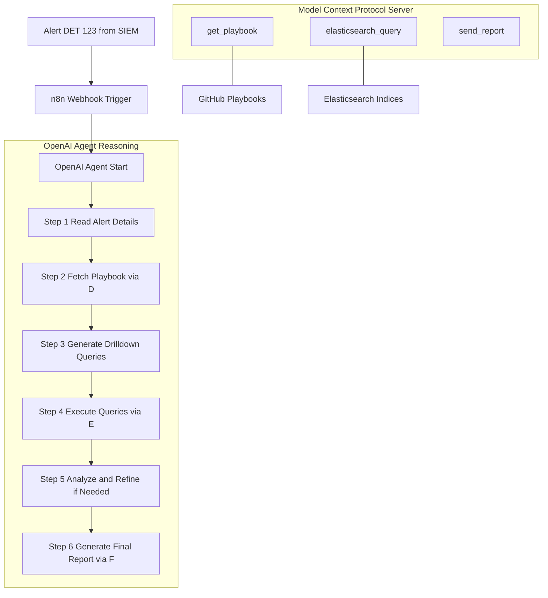

```mermaid
flowchart TD
    A[Alert DET 123 from SIEM] --> B[n8n Webhook Trigger]
    B --> C[OpenAI Agent Start]

    subgraph MCP[Model Context Protocol Server]
        direction LR
        D[get_playbook]
        E[elasticsearch_query]
        F[send_report]
    end

    subgraph AGENT[OpenAI Agent Reasoning]
        direction TB
        C --> G[Step 1 Read Alert Details]
        G --> H[Step 2 Fetch Playbook via D]
        H --> I[Step 3 Generate Drilldown Queries]
        I --> J[Step 4 Execute Queries via E]
        J --> K[Step 5 Analyze and Refine if Needed]
        K --> L[Step 6 Generate Final Report via F]
    end

    D --- GIT[GitHub Playbooks]
    E --- ES[Elasticsearch Indices]

```