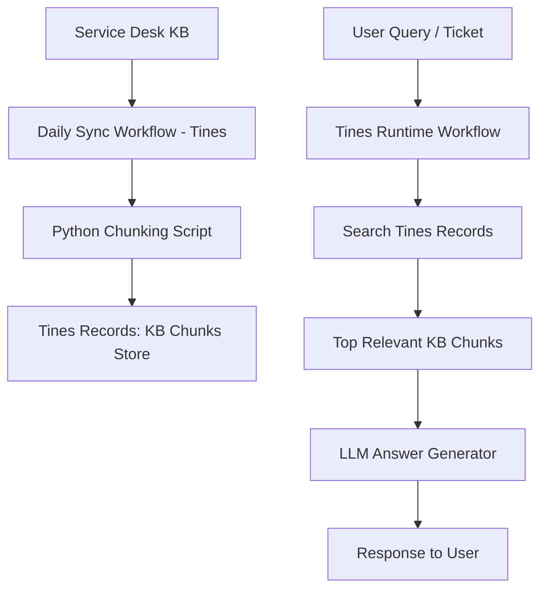

---

# Design Doc: LLM Wiki for Service Desk KB (Tines Records Based)

## 1. Overview

This system converts existing Service Desk Knowledge Base (KB) articles into **structured, chunked records** stored in Tines Records.
At runtime, user queries retrieve relevant chunks, which are passed to an LLM to generate grounded support responses.

---

## 2. Goals

* Enable AI-driven first-line support
* Keep Service Desk as source of truth
* Avoid vector DB complexity
* Ensure answers are grounded in KB content
* Support fast retrieval with metadata filtering

---

## 3. High-Level Architecture



---

## 4. Data Model (Tines Records)

### Record Type: `kb_chunks`

Each record = **one KB section (not full article)**

| Field         | Type                | Example                    |
| ------------- | ------------------- | -------------------------- |
| chunk_id      | string (unique key) | `123_step_2_windows`       |
| article_id    | string              | `123`                      |
| title         | text                | VPN Setup - Windows        |
| section_title | text                | Step 2: Connect            |
| content       | large text          | Click Advanced Settings... |
| tags          | array/string        | vpn, windows, login        |
| product       | text                | VPN Service                |
| os            | text                | Windows 11                 |
| error_codes   | text                | 809, 691                   |
| updated_at    | datetime            | 2026-05-03                 |

---

## 5. Ingestion Workflow (Daily Sync)

### Trigger

* Scheduled (daily or hourly)

### Steps

1. Fetch updated KB articles

   * API: `/kb/updated?since=last_run`

2. Python chunking script

   * Split by headings (H1/H2/H3)
   * Extract:

     * steps
     * troubleshooting
     * error sections

3. Transform into records

4. Upsert into Tines Records

---

## 6. Chunking Logic

### Rule

Each chunk = **one meaningful support unit**

Examples:

* Step in setup guide
* One troubleshooting scenario
* One error code explanation

---

### Python Chunking (simplified)

```python id="chunking"
def chunk_article(article):
    sections = article["content"].split("\n## ")

    chunks = []
    for i, sec in enumerate(sections):
        chunks.append({
            "chunk_id": f"{article['id']}_{i}",
            "article_id": article["id"],
            "title": article["title"],
            "section_title": sec.split("\n")[0],
            "content": sec,
            "tags": article.get("tags", []),
            "updated_at": article["updated_at"]
        })
    return chunks
```

---

## 7. Upsert Strategy (IMPORTANT)

### Key rule:

Use **deterministic chunk_id**

```text
chunk_id = article_id + "_" + section_index
```

### Logic:

| Case            | Action        |
| --------------- | ------------- |
| chunk_id exists | update record |
| new chunk_id    | create record |

This avoids duplicates and simplifies sync.

---

## 8. Runtime Workflow (Customer Query)

### Steps

1. User asks question
2. Tines triggers workflow
3. Query Tines Records:

   * filter by tags / keywords
   * optional OS/product filters
4. Return top 5–10 chunks
5. Send to LLM:

   * question
   * retrieved chunks
6. LLM generates grounded answer
7. Response sent to user/ticket

---

## 9. Retrieval Strategy (No Vector DB)

Primary:

* keyword search (VPN, error codes)

Secondary:

* metadata filters (OS, product)

Optional:

* simple scoring (match tags + keyword overlap)

---

## 10. Why This Works

| Benefit       | Reason                   |
| ------------- | ------------------------ |
| No vector DB  | Simpler architecture     |
| Fast          | direct record queries    |
| Deterministic | predictable results      |
| Auditable     | full trace of KB usage   |
| Low cost      | no embeddings at runtime |

---

## 11. Future Enhancements (Optional)

* Add embeddings later for fuzzy queries
* Add reranking step using LLM
* Add feedback loop from resolved tickets
* Auto-suggest KB improvements

---

## Summary

> KB articles → chunked → stored in Tines Records → queried at runtime → LLM generates answer from retrieved chunks

---
